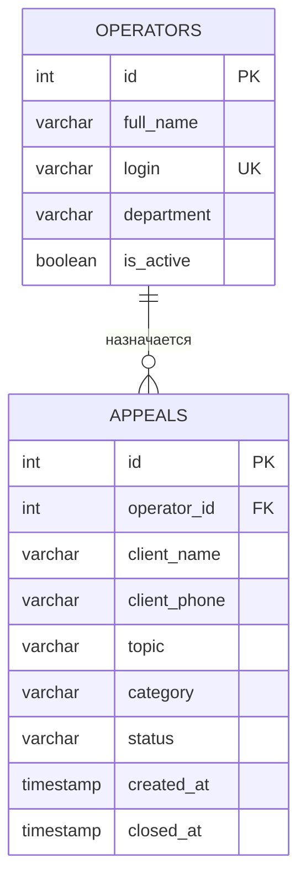

# Информационная система колл-центра

Консольное Java-приложение для учета обращений клиентов. Данные хранятся в PostgreSQL; доступ к ним выполняется через JDBC.

## Возможности

- CRUD для операторов и обращений;
- поиск по имени или телефону клиента, а также по теме;
- фильтрация по статусу и диапазону дат, сортировка по дате и статусу через Stream API;
- бизнес-проверки статусов, операторов и предельной нагрузки;
- статистика по обращениям;
- экспорт текущего списка обращений в `exports/appeals.xlsx` и `exports/appeals.csv`.

## Подготовка PostgreSQL

1. Создайте БД `call_center`.
2. Выполните скрипт [database/init.sql](database/init.sql).
3. Укажите свои URL, имя пользователя и пароль PostgreSQL в `src/main/resources/database.properties`.

Пример создания БД:

```sql
CREATE DATABASE call_center;
```

## Запуск

powershell -ExecutionPolicy Bypass -File .\run.ps1

Требуется JDK 17+ и Maven 3.9+.

```powershell
mvn clean compile
mvn exec:java
```

## Слои приложения

```text
Console UI (Main) -> Service -> Repository (JDBC) -> PostgreSQL
```

В `Main` находятся только меню и чтение ввода. Сервисы содержат правила предметной области, репозитории - параметризованные SQL-запросы. `Repository<T, ID>` демонстрирует интерфейс и полиморфизм.

## ER-диаграмма



## Бизнес-правила

1. ФИО, логин, отдел, имя клиента, телефон и тема обязательны.
2. Оператор для назначения должен существовать и быть активным.
3. Допустимы только категории `TECH`, `COMPLAINT`, `CONSULTATION`, `BILLING`.
4. Статусы меняются только по цепочке `NEW -> IN_PROGRESS -> ESCALATED/RESOLVED -> RESOLVED -> CLOSED`.
5. Закрытие невозможно без оператора; время закрытия задается автоматически.
6. У оператора не больше пяти активных обращений.
