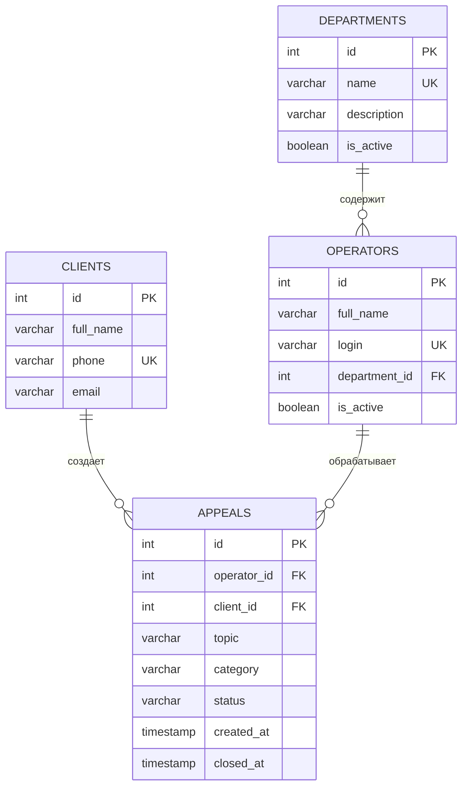

# Информационная система колл-центра

Консольное Java-приложение для учета обращений клиентов. Предметная модель содержит четыре сущности: `Operator`, `Client`, `Department` и `Appeal`. Данные хранятся в PostgreSQL; доступ к ним выполняется через JDBC.

## Возможности

- CRUD для операторов, клиентов, отделов и обращений;
- поиск по имени или телефону клиента, а также по теме;
- фильтрация по статусу и диапазону дат, сортировка по дате и статусу через Stream API;
- бизнес-проверки статусов, операторов и предельной нагрузки;
- статистика по обращениям;
- экспорт текущего списка обращений в `exports/appeals.xlsx` и `exports/appeals.csv`.

## Подготовка PostgreSQL

1. Создайте пустую БД `call_center`.
2. Выполните скрипт [database/init.sql](database/init.sql). Скрипт удаляет существующие таблицы проекта и предназначен для новой или демонстрационной БД.
3. Укажите свои URL, имя пользователя и пароль PostgreSQL в `src/main/resources/database.properties`.

Пример создания БД:

```sql
CREATE DATABASE call_center;
```

## Запуск

```powershell
powershell -ExecutionPolicy Bypass -File .\run.ps1
```

Требуется JDK 17+ и Maven 3.9+.

На этой машине системная служба PostgreSQL может быть остановлена. Если порт `5432` недоступен, `run.ps1` запускает локальный кластер из `.tools/pg-check` (если он существует). Данные этого кластера находятся в `.tools/pg-check` и не попадают в Git. Для другого компьютера запустите свою службу PostgreSQL, создайте базу `call_center` и выполните `database/init.sql` либо задайте адрес подключения через `CALLCENTER_DB_URL`.

```powershell
mvn clean compile
mvn exec:java
```

## Сущности и связи

- `Department` — подразделение колл-центра;
- `Operator` — оператор, принадлежащий подразделению;
- `Client` — клиент с уникальным телефоном;
- `Appeal` — обращение клиента, назначенное оператору.

`operators.department_id` ссылается на `departments.id`, а `appeals.client_id` — на `clients.id`. Имя и телефон клиента при выводе получаются через SQL JOIN, поэтому исправление карточки клиента видно в обращениях.

## Слои приложения

```text
Console UI (Main) -> Service -> Repository (JDBC) -> PostgreSQL
```

В `Main` находятся только меню и чтение ввода. Сервисы содержат правила предметной области, репозитории — параметризованные SQL-запросы. `Repository<T, ID>` демонстрирует интерфейс и полиморфизм.

## ER-диаграмма



## Бизнес-правила

1. ФИО, логин, ID отдела, имя и телефон клиента, ID клиента в обращении и тема обязательны.
2. Назначаемый оператор и клиент должны существовать; для новых назначений оператор должен быть активным.
3. Допустимы только категории `TECH`, `COMPLAINT`, `CONSULTATION`, `BILLING`.
4. Статусы меняются только по цепочке `NEW -> IN_PROGRESS -> ESCALATED/RESOLVED -> RESOLVED -> CLOSED`.
5. Перевод в работу и закрытие невозможны без оператора; время закрытия задаётся автоматически.
6. У оператора не больше пяти активных обращений.

## Проверка

Для автоматического интеграционного теста создайте отдельную PostgreSQL-базу, выполните в ней `database/init.sql` и задайте переменные `CALLCENTER_DB_URL`, `CALLCENTER_DB_USER`, `CALLCENTER_DB_PASSWORD`. Затем запустите `mvn test`. Без `CALLCENTER_DB_URL` интеграционный тест пропускается. Например:

```powershell
$env:CALLCENTER_DB_URL = 'jdbc:postgresql://localhost:5432/call_center_test'
$env:CALLCENTER_DB_USER = 'postgres'
$env:CALLCENTER_DB_PASSWORD = 'ваш_пароль'
mvn test
```

Краткая теория и сценарий демонстрации находятся в [DEFENSE.md](DEFENSE.md).
